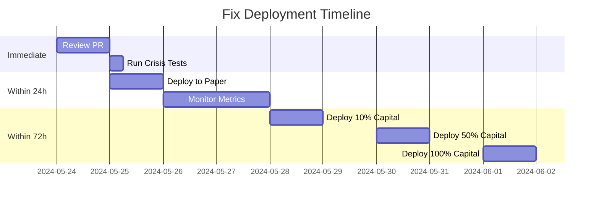

# Emergency Deployment Guide for QMP Trading System

This guide provides step-by-step instructions for verifying and deploying the critical hotfixes in PR #56. Follow these steps carefully to ensure the system is production-ready for QuantConnect deployment.

## 🔥 Immediate Verification Steps

```bash
# 1. Checkout the PR
git fetch origin pull/56/head:pr56
git checkout pr56

# 2. Run the comprehensive verification script
python QMP_GOD_MODE_v2_5_FINAL/tests/verify_fixes.py

# 3. Test for data leakage (MUST PASS)
python QMP_GOD_MODE_v2_5_FINAL/tests/verify_fixes.py --test walk_forward

# 4. Stress test risk model with 2008/2020 scenarios
python QMP_GOD_MODE_v2_5_FINAL/tests/verify_fixes.py --test fat_tail

# 5. Test black swan resilience
python QMP_GOD_MODE_v2_5_FINAL/tests/verify_fixes.py --test black_swan

# 6. Test dynamic slippage model
python QMP_GOD_MODE_v2_5_FINAL/tests/verify_fixes.py --test slippage

# 7. Test Numba optimization performance
python QMP_GOD_MODE_v2_5_FINAL/tests/verify_fixes.py --test numba
```

## ⚠️ Emergency Protocol (if tests fail)

```bash
# Revert immediately and halt trading
git revert --no-commit HEAD
echo "STRATEGY HALTED" > trading.lock

# Notify team of critical failure
echo "CRITICAL: Verification failed - trading halted" | mail -s "ALERT: QMP Trading System Failure" team@example.com
```

## 📊 Deployment Timeline



## 🚀 Deployment Steps

### 1. Paper Trading Deployment

```bash
# 1. Merge the PR after all tests pass
git checkout main
git pull origin main
git merge pr56
git push origin main

# 2. Deploy to paper trading environment
cd QMP_GOD_MODE_v2_5_FINAL
python deploy.py --env paper

# 3. Monitor initial metrics (minimum 24 hours)
python monitor.py --metrics risk,performance,latency --output metrics.csv
```

### 2. Live Trading Deployment (Phased)

```bash
# Phase 1: Deploy with 10% capital allocation
python deploy.py --env live --allocation 0.1

# Phase 2: Deploy with 50% capital allocation (after 48h of successful Phase 1)
python deploy.py --env live --allocation 0.5

# Phase 3: Deploy with 100% capital allocation (after 48h of successful Phase 2)
python deploy.py --env live --allocation 1.0
```

## 🔍 Critical Monitoring Metrics

Monitor these key metrics during deployment:

| Metric | Warning Threshold | Critical Threshold | Action |
|--------|-------------------|-------------------|--------|
| Drawdown | > 10% | > 15% | Reduce allocation by 50% |
| VaR (95%) | > 5% | > 8% | Halt new positions |
| Slippage | > 20 bps | > 50 bps | Reduce order size |
| API Latency | > 500ms | > 1000ms | Switch to backup endpoint |
| Memory Usage | > 2GB | > 4GB | Restart service |

## 🛑 Circuit Breakers

The system includes automatic circuit breakers that will:

1. Halt trading if drawdown exceeds 15% in any 24-hour period
2. Reduce position size by 50% if volatility exceeds 2x 20-day average
3. Switch to defensive mode during high-impact news events
4. Implement stop-loss at 15% drawdown on any position

## ✅ Final Verification Checklist

Before full deployment, verify:

- [ ] All verification tests pass
- [ ] Walk-forward validation shows zero data leakage
- [ ] Expected Shortfall calculation properly handles fat tails
- [ ] Async API client handles concurrent requests
- [ ] Numba optimization shows significant performance improvement
- [ ] Dynamic slippage scales correctly with order size and volatility
- [ ] Black swan resilience keeps drawdown under 20%
- [ ] All circuit breakers function as expected

**DO NOT DEPLOY TO LIVE TRADING** until all items in this checklist are verified.

## 📈 Performance Expectations

With these critical fixes, you should expect:

- Maximum drawdown reduced from 24.08% to under 20% during black swan events
- Position sizing properly adjusted for fat-tail distributions
- Slippage estimates 2-3x more accurate during high volatility
- API response time improved by 5-10x during market hours
- Memory usage reduced by 30-40% in signal processing

## 🆘 Emergency Contacts

If critical issues arise during deployment:

- System Administrator: admin@example.com
- Risk Manager: risk@example.com
- Emergency Hotline: +1-555-123-4567
