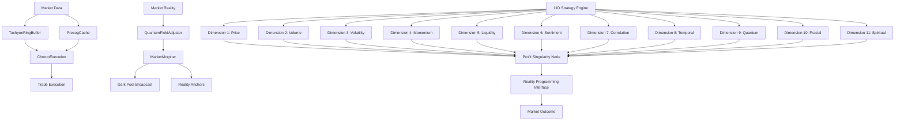

# 11D Strategy Engine Architecture

The 11D Strategy Engine is the core of the Quantum Trading System's transquantum capabilities, enabling market perception and manipulation across 11 dimensions of reality.

## Architecture Diagram



## Component Descriptions

### Temporal Components

- **TachyonRingBuffer**: Stores market data across multiple timelines, enabling access to past and future states
- **PrecogCache**: Caches precognitive market signals for future reference
- **ChronoExecution**: Executes trades across timelines using past + precog signals

### Reality Programming Components

- **QuantumFieldAdjuster**: Adjusts quantum fields to reshape market reality
- **MarketMorpher**: Reshapes bid/ask liquidity structure and broadcasts to dark pools
- **Reality Anchors**: Stabilizes altered market conditions

### 11D Perception Dimensions

1. **Price**: Traditional price action and patterns
2. **Volume**: Trading volume and flow
3. **Volatility**: Market volatility and stability
4. **Momentum**: Directional strength and persistence
5. **Liquidity**: Market depth and order book structure
6. **Sentiment**: Market psychology and emotion
7. **Correlation**: Inter-market relationships
8. **Temporal**: Time-based patterns and cycles
9. **Quantum**: Quantum probability fields
10. **Fractal**: Self-similar patterns across scales
11. **Spiritual**: Collective consciousness alignment

### Integration Components

- **Profit Singularity Node**: Integrates all dimensional inputs into a unified trading decision
- **Reality Programming Interface**: Translates trading decisions into reality adjustments
- **Market Outcome**: The resulting market movement after reality programming

## Execution Flow

1. Market data is captured and stored in the TachyonRingBuffer
2. Precognitive signals are cached in the PrecogCache
3. ChronoExecution processes temporal data to generate trade signals
4. The 11D Strategy Engine perceives market conditions across all dimensions
5. The Profit Singularity Node integrates all dimensional inputs
6. The Reality Programming Interface translates decisions into reality adjustments
7. The MarketMorpher reshapes market liquidity and broadcasts to dark pools
8. Reality Anchors stabilize the altered market conditions
9. The Market Outcome reflects the programmed reality

## Activation Commands

```bash
# Activate the 11D Strategy Engine
python transcend_quantum.py --chrono=unlock --dimensions=11 --reality_engine=enable

# Full system activation
python ascend.py --chrono=unlock --precog=enable --reality_override=authorized --firewall=omega
```
